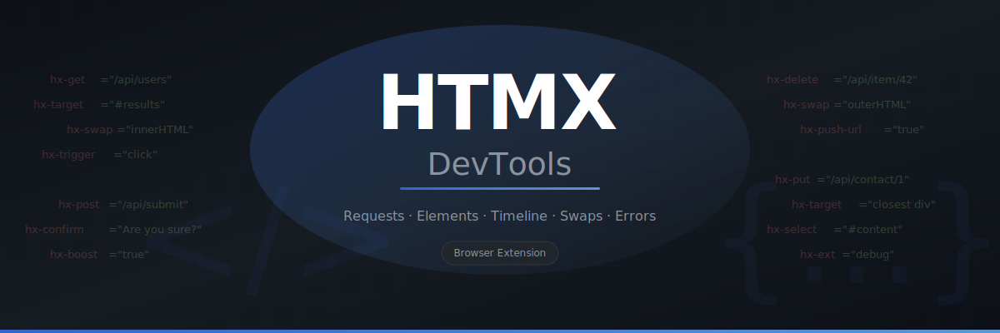
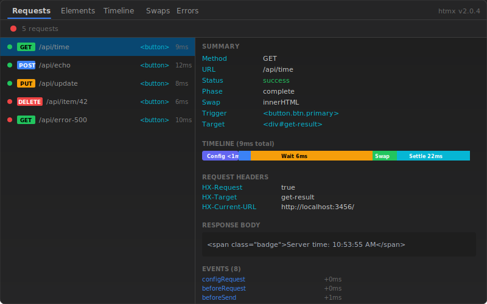
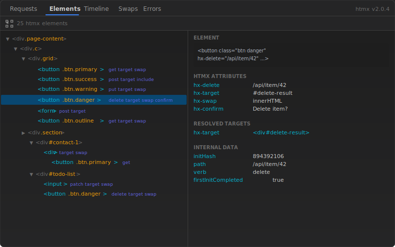
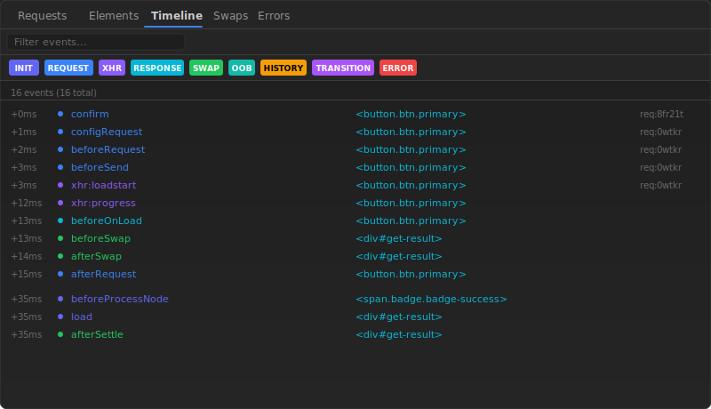
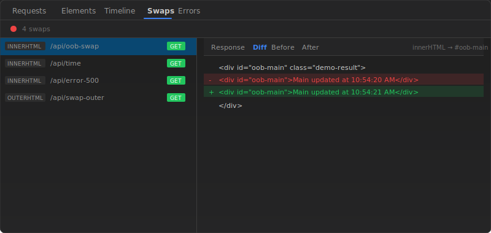
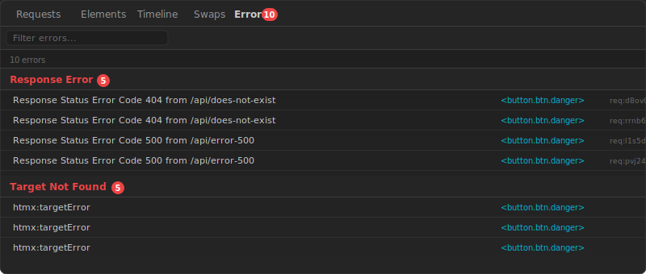

<p align="center">
  
</p>

<h1 align="center">&lt;/&gt; HTMX DevTools</h1>

<p align="center">
  Browser DevTools extension for debugging <a href="https://htmx.org">HTMX</a> applications.<br>
  Inspect requests, elements, events, swaps, and errors in real time.
</p>

<p align="center">
  <a href="https://atoolz.github.io/htmx-devtools/">Live Demo</a> &middot;
  <a href="#installation">Install</a> &middot;
  <a href="#features">Features</a> &middot;
  <a href="#how-it-works">Architecture</a>
</p>

---

## Features

### Request Inspector

Capture the full HTMX request lifecycle with timing breakdown, headers, request/response body, and event trace.

- HTTP verb, URL, status, swap strategy
- Trigger and target element identification
- Visual timeline bar (Config > Send > Wait > Swap > Settle)
- HX-* request and response headers
- Record / Pause / Clear controls

<p align="center">
  
</p>

### Element Inspector

Live DOM tree showing all HTMX elements with their hierarchy, attributes, and resolved targets. Updates in real time as the page changes.

- Collapsible DOM tree filtered to HTMX-relevant nodes
- Click to inspect: shows `hx-*` attributes, resolved targets, internal data
- Element picker: click any element on the page to inspect it
- Hover highlighting on the inspected page

<p align="center">
  
</p>

### Event Timeline

Filterable timeline of all HTMX events with category color coding and expandable detail payloads.

- Category filters: Init, Request, XHR, Response, Swap, OOB, History, Transition, Error
- Timestamps relative to first event
- Click to expand full `event.detail` JSON
- Request correlation (linked request ID)

<p align="center">
  
</p>

### Swap Visualizer

Record DOM swaps with before/after snapshots and diff view.

- Record / Pause controls
- Response HTML view
- Before / After DOM snapshots
- Line-by-line diff with add/remove highlighting
- Swap strategy and target element info

<p align="center">
  
</p>

### Error Panel

Surface silent HTMX failures grouped by error type with badge counts.

- Response errors (4xx, 5xx)
- Target not found errors
- Network timeouts and swap errors
- Click to jump to associated request

<p align="center">
  
</p>

---

## Installation

### From source

```bash
git clone https://github.com/atoolz/htmx-devtools.git
cd htmx-devtools
npm install
npm run build:chrome
```

**Chrome / Edge / Brave / Arc:**

1. Open `chrome://extensions`
2. Enable **Developer mode**
3. Click **Load unpacked**
4. Select the `dist/` folder

**Firefox:**

```bash
npm run build:firefox
```

1. Open `about:debugging#/runtime/this-firefox`
2. Click **Load Temporary Add-on**
3. Select `dist/manifest.json`

---

## Live Demo

Try the extension with the interactive demo page (no server needed):

**[atoolz.github.io/htmx-devtools](https://atoolz.github.io/htmx-devtools/)**

The demo uses a client-side mock server that intercepts XMLHttpRequest, so all HTMX features work in the browser. Install the extension, open the demo, and press F12 > HTMX tab.

---

## How it works

```
Page Script          Content Script       Service Worker       DevTools Panel
(MAIN world)         (isolated)           (background)         (Preact UI)

Captures htmx    ->  Relays via        -> Routes messages,  -> Renders 5 tabs
events on            postMessage +         maintains state      with real-time
document             runtime.sendMessage   per tab              updates
```

- **Page Script** runs in the page's JS context via `"world": "MAIN"` content script. Listens to all `htmx:*` events, serializes element data, and batches messages every 50ms.
- **Content Script** bridges page and extension contexts via `window.postMessage` and `chrome.runtime.sendMessage`.
- **Background Service Worker** manages per-tab state, tracks request lifecycles, correlates events to requests, and routes data to the panel.
- **Panel** is a Preact + Signals app (50KB) rendered inside `chrome.devtools.panels.create()`.

---

## Development

```bash
npm run dev            # Watch mode (rebuilds on changes)
npm run build          # Production build
npm run build:chrome   # Build + copy Chrome manifest + icons
npm run build:firefox  # Build + copy Firefox manifest + icons
npm run typecheck      # TypeScript type check
npm run test           # Run tests
```

### Local test server

```bash
node test/e2e/fixtures/test-server.js
# Open http://localhost:3456
```

Covers: GET/POST/PUT/DELETE, error scenarios (404, 500, timeout), all swap strategies, OOB swaps, polling, search with delay, contact editor (click-to-edit), and todo list.

---

## Tech Stack

| | |
|---|---|
| **Language** | TypeScript |
| **Build** | Vite (multi-entry, IIFE outputs for content/page/background scripts) |
| **UI** | Preact + @preact/signals (3KB gzipped) |
| **Manifest** | Chrome MV3 (also Firefox MV3 128+) |
| **Target** | Chrome, Edge, Brave, Arc, Opera, Firefox |

---

## License

MIT
